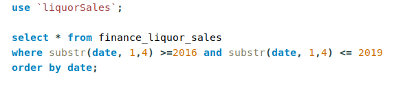

# Final-Assignment

- ###### Step 1.

Added the Dataset provided to Workbench.

- ###### Step 2.

Used the Query shown below to get all the columns of the table between the years 2016-2019

- ###### Step 3.

Exported the data to a CSV file

- ###### Step 4.

Used Python and Pandas to Aggregate the CSV data so we can get the most popular item sold based on zip code and percentage of sales per store.
Code and more details in the notebook: finalAssignment.ipynb

- ###### Step 5.

Use Matplotlib or Tableau with the newly made CSV file and present your Data.

## The visualization should look similar to something like this, but you are free to experiment. :

### 1.  If you are using Matplotlib

### 2. If you are using Tableau

